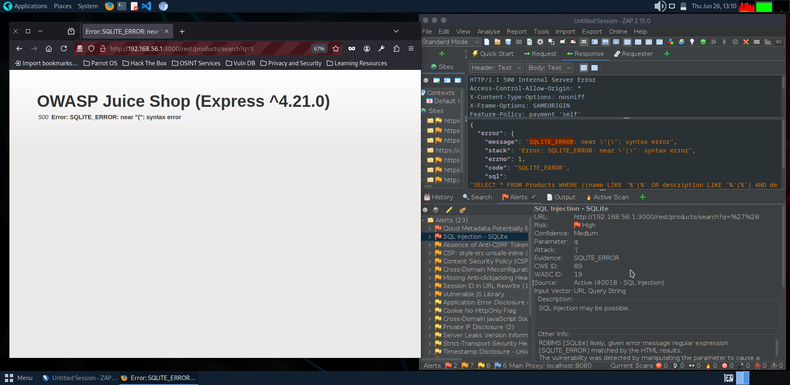
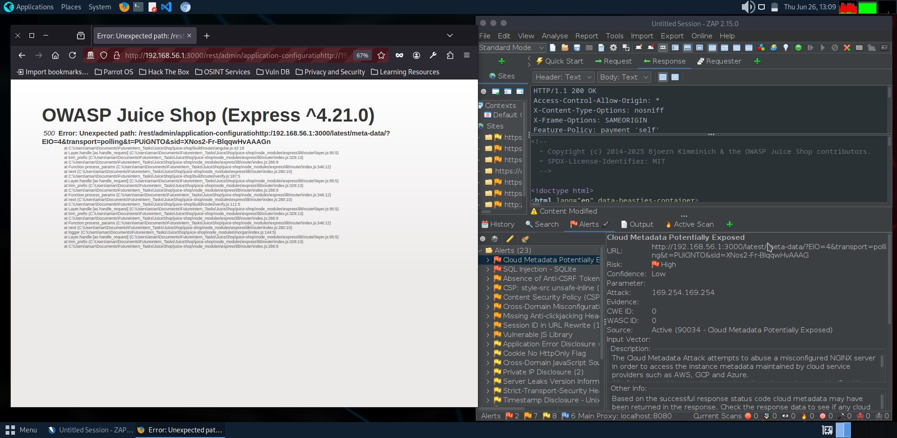
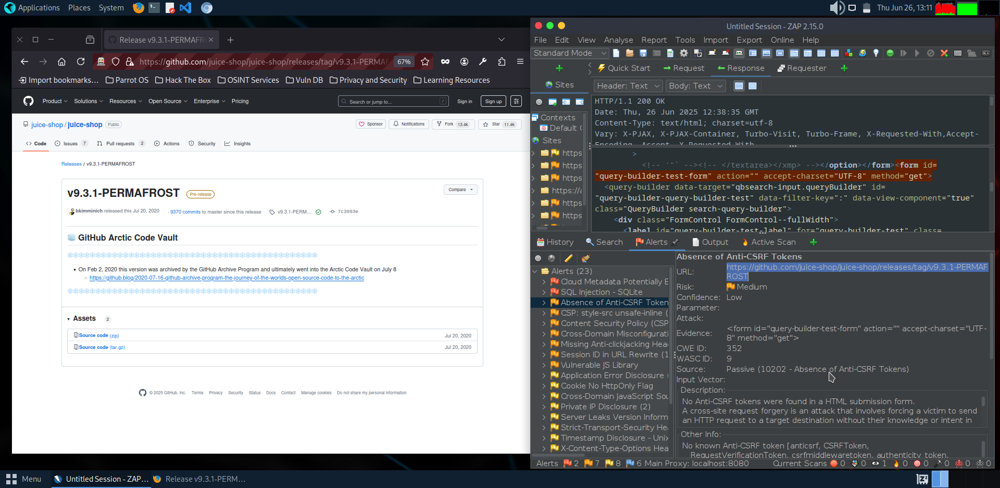
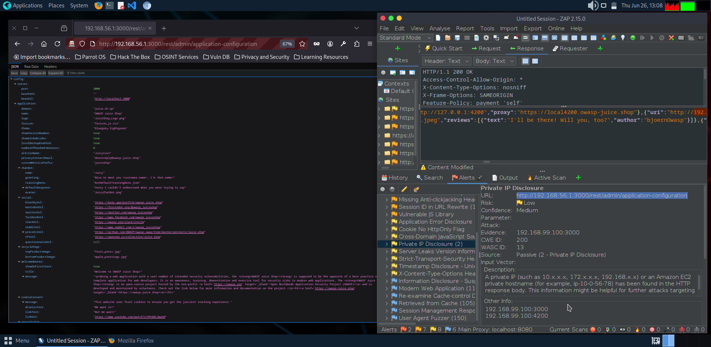
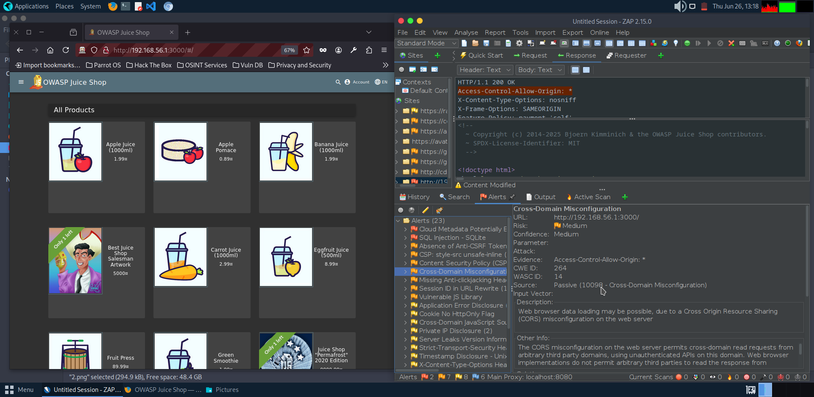

# 🛡️ Security Assessment Report – OWASP Juice Shop

---

## 📌 Project Title:
**Vulnerability Assessment of OWASP Juice Shop Web Application**

### 👨‍💻 Internship Program:
**Future Interns – Cybersecurity Internship**  
Conducted by Future Interns

### 🧑‍🎓 Intern Name:
**Aman Patel**  
Cybersecurity & Ethical Hacking Enthusiast

### 🧰 Tools & Technologies Used:
- ⚙️ OWASP ZAP  
- 🐧 Parrot OS (VM)  
- 🛍️ OWASP Juice Shop  
- 🌐 Web Browser (Firefox)  
- 📝 LibreOffice Writer

### 🗓️ Assessment Date:
**09th June 2025**

### 🌍 Test Environment:
- Host Machine: Windows 11  
- Attacker Machine: Parrot OS (VirtualBox VM)  
- Target: OWASP Juice Shop (localhost or LAN IP)

---

## 🧾 Executive Summary

This report presents a comprehensive vulnerability assessment conducted on the OWASP Juice Shop, a deliberately insecure web application used for educational and security testing purposes.

The objective of this assessment was to simulate real-world penetration testing techniques and identify common web application vulnerabilities in a safe and controlled environment.

The assessment was carried out using Parrot OS (in a virtual machine) and industry-standard tools such as OWASP ZAP, targeting a locally hosted instance of Juice Shop on the host Windows machine.

During the assessment, five distinct web application vulnerabilities were discovered and documented, including input validation issues, sensitive data exposure, and broken access controls. Each vulnerability was captured with technical evidence and accompanied by relevant screenshots.

### 📋 This report provides:
- A summary of the identified vulnerabilities  
- Their potential security impact  
- Steps to reproduce them  
- Suggested mitigation strategies

---

## 🧪 Methodology

### 🛠️ 1. Environment Setup
- ✅ Target Application: OWASP Juice Shop (Hosted on Windows using Node.js)  
- ✅ Attacker Machine: Parrot OS (Virtual Machine via VirtualBox)  
- ✅ Communication: Juice Shop accessed via host IP (e.g., http://192.168.x.x:3000)

### 🔍 2. Scanning & Enumeration
- Launched OWASP ZAP  
- Performed Passive Scan via browser proxy  
- Initiated Active Scan for deeper vulnerability detection

### ⚙️ 3. Vulnerability Discovery
- Manually tested features (Login, Signup, Products...)  
- Observed ZAP alerts and server responses  
- Identified 5 unique vulnerabilities

### 📸 4. Documentation & Evidence
- Screenshots for each issue  
- Documented:
  - Affected endpoint  
  - Technical explanation  
  - Risks  
  - Reproduction steps  
  - Recommended fix

### 🛡️ 5. Tools Summary

| Tool             | Purpose                          |
|------------------|----------------------------------|
| OWASP Juice Shop | Vulnerable test target           |
| OWASP ZAP        | Scanning and vulnerability detection |
| Parrot OS        | Attacker machine                 |
| Firefox          | Manual browser interaction       |
| Screenshot Tool  | Capturing visual evidence        |

---

## 🛑 Vulnerability #1: SQL Injection

- 🔐 Severity: **High**  
- 📚 OWASP Category: A1 - Injection  
- 🧠 CWE ID: CWE-89  
- 🌐 Endpoint: `http://192.168.56.1:3000/rest/products/search?q='`

**📝 Description:**  
SQL injection due to unsanitized input in search query, leading to potential data leakage or manipulation.

**💥 ZAP Alert Message:**
```
"message": "SQLITE_ERROR: near "'": syntax error",
"error": "SQLITE_ERROR: near "'": syntax error"
```

**⚠️ Impact:**
- 🛂 Authentication bypass  
- 🗃️ User data extraction  
- ✏️ Record modification  
- 🔓 Escalation of privileges  

**🛡️ Recommendations:**
- ✅ Use parameterized queries  
- 🚫 Avoid dynamic SQL  
- 🧼 Input validation  
- 🧱 Deploy WAF

**🖼️ Visual Evidence:**



---

## 🛑 Vulnerability #2: Cloud Metadata Exposure

- 🟡 Risk Level: **Medium**  
- 🌐 URL: `http://192.168.56.1:3000/../meta/data/?`  
- 🧠 CWE ID: CWE-200  
- 🔍 Source: ZAP Active Scan

**📝 Description:**  
Application responds to cloud metadata endpoint requests, which could lead to sensitive cloud info exposure.

**💥 Impact:**
- Temporary credential leakage  
- Cloud service exploitation  
- Privilege escalation  

**🛡️ Mitigation:**
- Block access to `169.254.169.254`  
- Restrict internal metadata exposure  
- Use firewall/web server filters

**🖼️ Visual Evidence:**


---

## 🛑 Vulnerability #3: Absence of Anti-CSRF Tokens

- 🟡 Risk Level: **Medium**  
- 🔐 URL: Login & other forms  
- 🧠 CWE ID: CWE-352  
- 🧾 Source: ZAP Passive Scan

**📝 Description:**  
No CSRF token found in sensitive forms; attacker could trick users into performing actions.

**💥 Impact:**
- Account hijack  
- Data manipulation  
- Unauthorized submissions  

**🛡️ Mitigation:**
- Implement CSRF tokens  
- Validate origin headers  
- Set `SameSite` cookies

**🖼️ Visual Evidence:**


---

## 🛑 Vulnerability #4: Private IP Disclosure

- 🟡 Risk Level: **Medium**  
- 🌐 URL: `/rest/admin/application-configuration`  
- 🧠 CWE ID: CWE-200  
- 🔍 Source: ZAP Passive Scan

**📝 Description:**  
Response exposes internal IPs like `127.0.0.1`, `192.168.99.100` — aids attacker recon.

**💥 Impact:**
- Network mapping  
- SSRF opportunities  
- Targeted attacks  

**🛡️ Mitigation:**
- Sanitize response data  
- Disable debug info in prod  
- Conduct config audits

**🖼️ Visual Evidence:**


---

## 🛑 Vulnerability #5: Cross-Domain Misconfiguration (CORS)

- 🟡 Risk Level: **Medium**  
- 🌐 URL: `http://192.168.56.1:3000/`  
- 🧠 CWE ID: CWE-264  
- 🔍 Source: ZAP Passive Scan

**📝 Description:**  
`Access-Control-Allow-Origin: *` allows any domain to read server responses — unsafe if auth is involved.

**💥 Impact:**
- Session hijack via XSS  
- Unintended API access  
- CORS abuse  

**🛡️ Mitigation:**
- Avoid `*` wildcard  
- Whitelist trusted origins  
- Secure cookies & headers

**🖼️ Visual Evidence:**


---

## 📊 Risk Assessment

| 🔢 No. | Vulnerability                         | Risk Level | CWE ID  | Affected Area         | Impact Description                             |
|-------|----------------------------------------|------------|---------|------------------------|------------------------------------------------|
| 1️⃣    | SQL Injection                         | 🔴 High     | CWE-89  | Search Query Field     | DB compromise, data theft                      |
| 2️⃣    | Cloud Metadata Exposure               | 🟡 Medium   | CWE-200 | Meta-data endpoint     | Internal data leak                             |
| 3️⃣    | Absence of Anti-CSRF Tokens           | 🟡 Medium   | CWE-352 | Login & form inputs    | Unauthorized actions                           |
| 4️⃣    | Private IP Disclosure                 | 🟡 Medium   | CWE-200 | Admin config API       | Network recon                                  |
| 5️⃣    | Cross-Domain Misconfiguration (CORS)  | 🟡 Medium   | CWE-264 | HTTP headers           | External abuse of API                          |

---

## ✅ Conclusion

The assessment identified 5 real-world vulnerabilities demonstrating common yet dangerous flaws in modern web apps:

- 🔴 SQL Injection  
- ⚠️ Cloud Metadata Exposure  
- ⚠️ Private IP Disclosure  
- ⚠️ Absence of Anti-CSRF Tokens  
- ⚠️ Cross-Domain Misconfiguration

This project helped solidify skills in:
- 🔍 Recon & scanning  
- 🛠️ Using OWASP ZAP  
- 📋 Creating professional security reports  

### 💡 Final Note:
Security isn’t a one-time activity — it must be continuous and proactive. Integrating security into development and regularly assessing systems can prevent major breaches.

---

## 📎 Annexure

### 🔧 Tools Used
- OWASP Juice Shop  
- OWASP ZAP  
- Parrot OS  
- Firefox  
- LibreOffice / Screenshot Tools

### 🔖 References
- [OWASP Juice Shop](https://owasp.org/www-project-juice-shop/)  
- [OWASP Top 10](https://owasp.org/www-project-top-ten/)  
- [CWE Database](https://cwe.mitre.org/)  
- [ZAP Docs](https://www.zaproxy.org/docs/)

### 🙏 Acknowledgements
Project submitted as part of **Future Interns – Cybersecurity Internship** by *Future Interns*.  
Special thanks to the **OWASP community** for the tools and resources.

---
